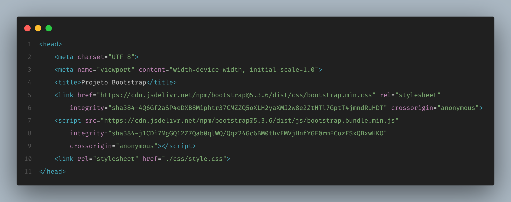
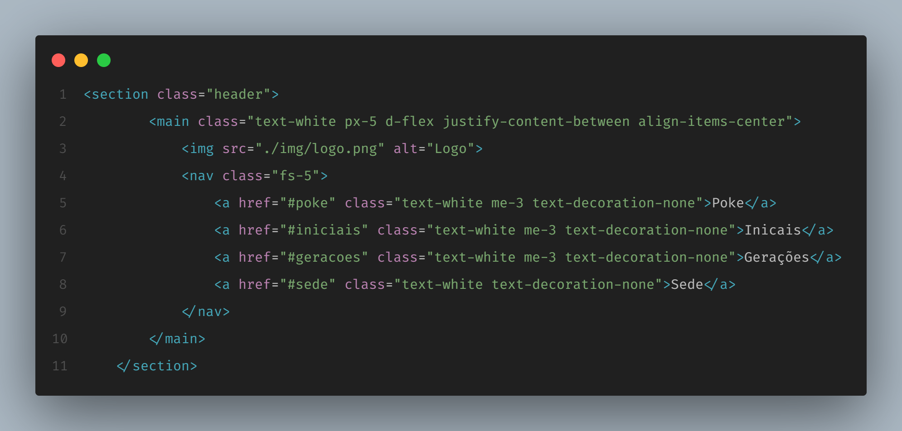

# Iniciativa Bootstrap

## Objetivo e Finalização
- Criar um site com inspiração no prototipo do figma usando com foco principal o Bootstrap com no máximo 50 linhas de CSS e sem usar style no HTML. ([Prototipo Figma](https://www.figma.com/design/oOFBBoa0AtyXowgB7qnFWD/Iniciativa-Bootstrap?node-id=1-2))
- Escolher um tema para fazer o site. Tema escolhido: ==Pokemon==
- [Resultado.](https://koalastockler.github.io/projeto-iniciativa-bootstrap/?classId=b41f39a6-994f-44a9-b3a9-24070f7e1649&assignmentId=976ff913-eea0-4606-a2ad-92ca80662663&submissionId=6ced5653-f7a1-6119-1735-cd3fd20f9e24)
---
### 🤯 Head 🤯


###### Codigo necessário para linkar com o Bootstrap v5.3
``` html
<link href="https://cdn.jsdelivr.net/npm/bootstrap@5.3.6/dist/css/bootstrap.min.css" rel="stylesheet" integrity="sha384-4Q6Gf2aSP4eDXB8Miphtr37CMZZQ5oXLH2yaXMJ2w8e2ZtHTl7GptT4jmndRuHDT" crossorigin="anonymous">
```
###### Codigo necessário para o JS do Bootstrap funcionar 
``` html
<script src="https://cdn.jsdelivr.net/npm/bootstrap@5.3.6/dist/js/bootstrap.bundle.min.js" integrity="sha384-j1CDi7MgGQ12Z7Qab0qlWQ/Qqz24Gc6BM0thvEMVjHnfYGF0rmFCozFSxQBxwHKO" crossorigin="anonymous"></script>
```
---
### ✨ Header ✨



#### 🧾 Header do Site
A seção do Header foi construída utilizando Bootstrap 5.3, aproveitando suas classes utilitárias para criar um layout responsivo e alinhado visualmente de forma simples e eficiente.
``` html
<main class="text-white px-5 d-flex justify-content-between align-items-center">
```
#### 🎯 Principais Classes do Bootstrap Utilizadas

| Classe                 | Função                                                                 |
|------------------------|------------------------------------------------------------------------|
| `text-white`           | Aplica cor branca ao texto                                             |
| `px-5`                 | Padding horizontal (`padding-left` e `padding-right`) com valor `5`    |
| `d-flex`               | Ativa o display `flex`                                                 |
| `justify-content-between` | Alinha os itens com espaço entre eles (logo à esquerda e nav à direita) |
| `align-items-center`   | Centraliza verticalmente os itens no contêiner flexível                |
| `fs-5`                 | Define o tamanho da fonte como `1.25rem`                               |
| `me-3`                 | `margin-end` (direita) com valor `3` — usado para espaçamento entre os links |
| `text-decoration-none`| Remove sublinhado dos links                                            |

###### 🔗 Referências Oficiais do Bootstrap 5.3

- [Flexbox Utilities](https://getbootstrap.com/docs/5.3/utilities/flex/)
- [Spacing (Padding e Margin)](https://getbootstrap.com/docs/5.3/utilities/spacing/)
- [Text color](https://getbootstrap.com/docs/5.3/utilities/colors/#text)
- [Typography e Tamanhos de Fonte](https://getbootstrap.com/docs/5.3/utilities/text/#font-size)
- [Link Utilities](https://getbootstrap.com/docs/5.3/helpers/colored-links/)
---
### 